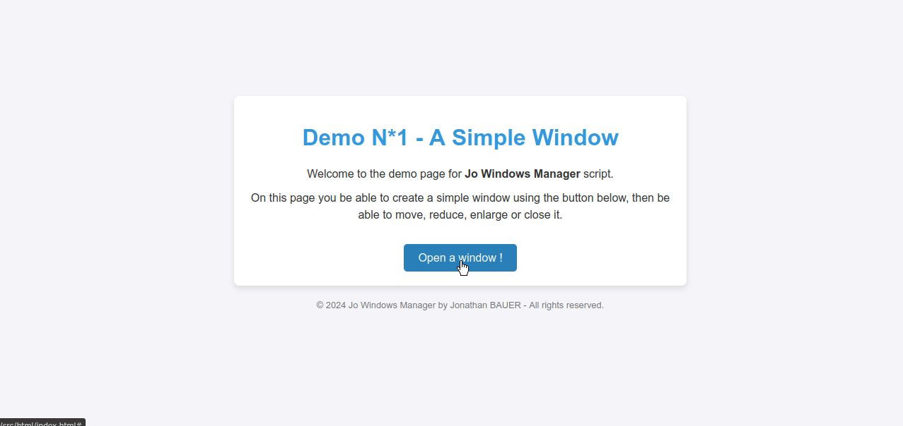

# [J-BAUER][EN] Jo Windows Manager : MessageBox Add-on
**J.W.M.-M.B.** is a add-on for **J.W.M.** that adds MessageBox functionality.</br>
Designed to be easy to use, it allows you to create a MessageBox with a single command.</br>
If needed, you can customize its behavior by setting various options.</br>
(WARNING: for this script to work you need [**J.W.M.**](https://github.com/jo57430/Web-JWM/) !)

> **By Jonathan BAUER (J-BAUER)**</br>
> Version: 1.0.0</br>
> Date: 10/11/2024</br>
> License: Apache 2.0</br>
> Requirement: [**J.W.M.** Ver: 1.0.0](https://github.com/jo57430/Web-JWM/)

## Demo


## How Does It Work ?
The system operates in there main stages:
1. **Create an instance of `JWM_WindowManager`**: This class manages all the windows it creates, providing a convenient way to create, modify, and update windows.
2. **Create you MessageBox by calling `newMessagebox` or `newMessageboxReponse`**: This function creates a window and populates it using the passed parameters.
3. **User select the action**: "The user then selects an action to perform, which is received as a callback or directly as an action ID number, after that the window closes automatically.

### Advanced Features
If needed, you can pass additional options to newMessagebox or newMessageboxResponse, these options are used by the MessageBox then passed internaly to the JWM_Window class to modify the behavior of the window.

## How to Install It
### Default method
Installing J.W.M.-M.B. is straightforward. Simply add the following line in the `<head>` section of your page, after the J.W.M. JavaScript files:
```html
<script src="https://raw.githack.com/jo57430/Web-JWM/refs/heads/master/lib/jwm_1-0-0.js"></script> <!-- <----- Add all the below line after this one !  -->

<script src="https://raw.githack.com/jo57430/Web-JWM_MB/refs/heads/master/lib/jwm-mb_1-0-0.js"></script>
<link href="https://raw.githack.com/jo57430/Web-JWM_MB/refs/heads/master/lib/assets/jwm-mb_1-0-0.css" rel="stylesheet"/>
```
That's all you need to do!

### Advanced (Local)
You can also download the latest release [HERE](https://github.com/jo57430/Web-JWM_MB/releases/latest/) and store it locally on your web server.</br>

## Example 
### newMessageboxReponse Example
Below is an example of how to create a MessaBox:
```javascript
// Step 1: Create an instance of JWM_WindowManager.
const windowManager = new JWM_WindowManager()

// Step 2: Create the message box and get what the user has selected.
let int_id = await JWM.newMessageboxReponse(1, 0, "My Window Title", "Welcome to my window content!", null);
```
### newMessagebox Example 
Below is an example of how to create a MessaBox:
```javascript
// Step 1: Create an instance of JWM_WindowManager.
const windowManager = new JWM_WindowManager()

// Step 2: Create the message box.
let obj_window = await JWM.newMessagebox(1, 0, "My Window Title", "Welcome to my window content!", null);
// Step 3: Get what the user has selected.
obj_window.setCallback((int_id)=>{

})
```