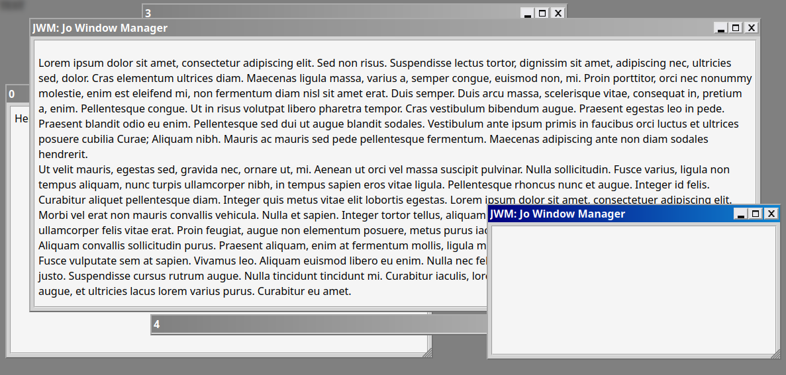

# [J-BAUER][EN] Jo Windows Manager : MessageBox Add-on

> **By Jonathan BAUER (J-BAUER)** 
> Version: 1.0 
> Date: 10/11/2024

## List of all Global Functions

### JWM.newMessagebox()

**Description:**  
Used to create a new message box.

**Parameters:**  
- `int_iconType` {number} - The icon to display.
  - `0`: No icon
  - `1`: Stop-sign icon
  - `2`: Question-mark icon
  - `3`: Exclamation-point icon
  - `4`: Information-sign
  - `5`: Custom icon, set with the option flag `customIcon`
- `int_buttonType` {number} - The button arrangement to use.
  - `0`: OK button
  - `1`: OK and Cancel
  - `2`: Abort, Retry, and Ignore
  - `3`: Yes, No, and Cancel
  - `4`: Yes and No
  - `5`: Retry and Cancel
  - `6`: Cancel, Try Again, Continue
- `str_title` {string} - The title of the window.
- `str_message` {string} - The message to display to the user.
- `obj_options` {object} _(Optional)_ - Used to personalize some of the behavior of this window/message box.

**Returns:**  
- `{JWM_Window}` - Returns the created message box window.

### JWM.newMessageboxReponse() (Async)

**Description:**  
Creates a new message box and returns the user’s selected choice.

**Parameters:**  
- `int_iconType` {number} - The icon to display.
  - `0`: No icon
  - `1`: Stop-sign icon
  - `2`: Question-mark icon
  - `3`: Exclamation-point icon
  - `4`: Information-sign
  - `5`: Custom icon, set with the option flag `customIcon`
- `int_buttonType` {number} - The button arrangement to use.
  - `0`: OK button
  - `1`: OK and Cancel
  - `2`: Abort, Retry, and Ignore
  - `3`: Yes, No, and Cancel
  - `4`: Yes and No
  - `5`: Retry and Cancel
  - `6`: Cancel, Try Again, Continue
- `str_title` {string} - The title of the window.
- `str_message` {string} - The message to display to the user.
- `obj_options` {object} _(Optional)_ - Used to personalize some of the behavior of this window/message box.

**Returns:**  
- `{number}` - Returns the user choice :
  - `0`: Close
  - `1`: OK
  - `2`: Cancel
  - `3`: Abort
  - `4`: Retry
  - `5`: Ignore
  - `6`: Yes
  - `7`: No
  - `8`: Try Again
  - `9`: Continue

---

## List of all `JWM_Window` sepcial Override Functions when created by `JWM.newMessagebox()`.

### onUse()

**Description:**  
Function called when the user has made a choice.

**Parameters:**  
- `int_id` {number} - The user choice :
  - `0`: Close
  - `1`: OK
  - `2`: Cancel
  - `3`: Abort
  - `4`: Retry
  - `5`: Ignore
  - `6`: Yes
  - `7`: No
  - `10`: Try Again
  - `11`: Continue

## List of all `JWM_Window` sepcial Functions when created by `JWM.newMessagebox()`.

### JWM.setCallback() (Async)

**Description:**  
Used to set the function called back when the user has made a choice.

**Parameters:**  
- `func_callback` {function} - The function to call when the user has made a choice.